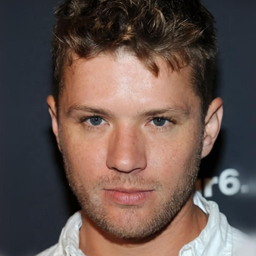
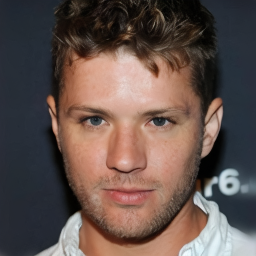

# Text to Image Project

## Dataset
- [CelebAMask-HQ](https://github.com/switchablenorms/CelebAMask-HQ): 30k images (size 256x256)

## Models
- Stable diffusion model
    - VQ-VAE: [CompVis/ldm-celebahq-256](https://huggingface.co/CompVis/ldm-celebahq-256)
    - Unet:
      
### VQ-VAE
Visualizae VQ-VAE
| Input Image | Encoded Image | Reconstructed Image|
| ----------- | ----------- | ----------- |
|  |  |  |
